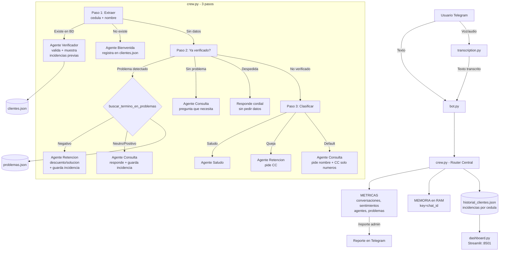

# Spark Next Talent Lab — Multiagente Conversacional

Prototipo de sistema multiagente para el reto tecnico del **Spark Next Talent Lab**
(Caso 4: Multiagente Conversacional). Evaluadora: Jenny Paola Cortes.

---

## Stack tecnologico

| Componente | Tecnologia |
|---|---|
| LLM | Groq Llama 3.3 70B (`llama-3.3-70b-versatile`) |
| Transcripcion de voz | Groq Whisper (`whisper-large-v3-turbo`) |
| Bot | python-telegram-bot v22+ |
| Dashboard | Streamlit + Pandas + Plotly |
| Datos | JSON (20 clientes + 13 tipos de problema + historial persistente) |
| Logging | Archivos rotativos diarios en `logs/` |
| Idioma | Bilingue (espanol/ingles) con deteccion por lexico |

---

## Arquitectura del sistema



### Flujo completo

**Paso 1 — Identificacion:**
- Si da nombre + CC (solo numeros) → buscar en `clientes.json`
  - Existe + nombre coincide → **Agente Verificador** + muestra incidencias previas
  - Existe + nombre NO coincide → error "registrada con otro nombre"
  - No existe → lo **registra automaticamente** y da bienvenida
- Si no da datos → pasa al Paso 3

**Paso 2 — Cliente verificado:**
- Detecta problema por keywords (`problemas.json`)
- Si es negativo → **Agente Retencion** + guarda en `historial_clientes.json`
- Si es neutro/positivo → **Agente Consulta** + guarda en `historial_clientes.json`
- Si es despedida ("gracias", "adios", "bye") → responde cordial sin pedir datos
- Si no detecta nada → pregunta que necesita

**Paso 3 — No verificado:**
- Saludo → **Agente Saludo** (pide nombre + CC solo numeros)
- Queja → **Agente Retencion** (pide identificarse)
- Default → **Agente Consulta** (pide datos)

---

## Agentes del sistema (5)

| Agente | Archivo | Rol |
|---|---|---|
| Saludo | `agents/greeting_agent.py` | Primera impresion, pide nombre + CC solo numeros |
| Verificador | `agents/verifier_agent.py` | Valida identidad, muestra incidencias previas |
| Consulta | `agents/query_agent.py` | Resuelve consultas, referencia historial |
| Retencion | `agents/retention_agent.py` | Ofrece descuento/solucion, reconoce reincidencia |
| Analitico | `agents/analytics_agent.py` | Background, genera reportes via /reporte |

---

## Datasets

### `data/clientes.json`
20 registros iniciales. **Los nuevos clientes se agregan automaticamente** cuando se identifican por primera vez.

### `data/problemas.json`
13 tipos de problema detectables por keywords.

### `data/historial_clientes.json`
Se genera automaticamente. Guarda por cedula: nombre, fecha, tipo, descripcion y mensaje original del cliente. Persiste entre reinicios del bot.

### Palabras clave por tipo de problema

| Palabra clave en el mensaje | Tipo detectado | Sentimiento |
|---|---|---|
| internet, no funciona, corte, senal | problema_tecnico | negativo |
| factura, cobro, cobr, pago | problema_facturacion | negativo |
| saldo, cuenta | consulta_saldo | neutro |
| felicitar, upgrade, mejorar | felicitacion_upgrade | positivo |
| cancelar | cancelacion | negativo |
| contratar, nuevo servicio | nueva_contratacion | positivo |
| modem, router, equipo | problema_equipo | negativo |
| cambiar plan, plan mas | cambio_plan | neutro |
| queja, asesor, atencion | queja_atencion | negativo |
| cobertura | consulta_cobertura | neutro |
| actualizar, direccion | actualizacion_datos | neutro |
| promocion, oferta, descuento | promociones | positivo |
| velocidad, lento | problema_velocidad | negativo |

---

## Dashboard (Streamlit)

Visualiza en tiempo real los datos de `historial_clientes.json`:

```bash
cd multiagent
venv\Scripts\activate
streamlit run dashboard.py
```

Abre en **http://localhost:8501**. Muestra:
- Metricas: clientes, incidencias, top problema, ultima fecha
- Grafico de incidencias por tipo
- Grafico por cliente
- Evolucion temporal
- Tabla detallada con filtros

---

## Setup

### Requisitos
- Python 3.12+
- API key de [Groq](https://console.groq.com) (gratuita, ~30 req/min, 100k tokens/dia)
- Token de bot de [@BotFather](https://t.me/BotFather) en Telegram

### Instalacion

```bash
cd multiagent
python -m venv venv
venv\Scripts\activate
pip install -r requirements.txt
cp .env.example .env
```

Editar `.env`:
```
GROQ_API_KEY=gsk_tu_api_key
TELEGRAM_BOT_TOKEN=1234567890:ABCdefGHIjklmNOPqrSTUvwxYZ
ADMIN_CHAT_ID=1234567890
```

### Iniciar bot

```bash
python bot.py
```

### Iniciar dashboard (opcional)

```bash
streamlit run dashboard.py
```

### Ejecutar pruebas

```bash
python test_scenarios.py
```

---

## Ejemplos de interaccion

**Nuevo cliente:**
```
Usuario: Hola, soy Juan Perez y mi cedula es 9988776655
Bot: Bienvenido Juan Perez! Te hemos registrado en nuestro sistema.
     En que podemos ayudarte hoy?
```

**Cliente existente con historial:**
```
Usuario: Me llamo Carlos Munoz y mi cedula es 1012345678
Bot: Hola Carlos, verificacion exitosa. Veo que ya has tenido
     contacto con nosotros antes. Es por el mismo motivo?
```

**Despedida:**
```
Usuario: Gracias, que tengas buen dia
Bot: Gracias a ti por contactarnos. Que tengas un excelente dia.
     Si necesitas algo mas, aqui estaremos.
```

**Queja con reincidencia:**
```
Usuario: Estoy muy molesto, el internet no funciona
Bot: Lamento los inconvenientes. Veo que no es la primera vez
     que reportas este problema. Te ofrezco...
```

---

## Decisiones tecnicas

| Decision | Justificacion |
|---|---|
| **Groq SDK directo** | Mas estable que CrewAI (conflictos con Groq). Sin dependencias innecesarias. |
| **Router por keywords** | Rapido, deterministico, sin costo de API. El LLM solo genera respuestas. |
| **Registro automatico de nuevos clientes** | Simula un CRM real: cualquier persona que llame queda registrada. |
| **Historial persistente en JSON** | Sobrevive a reinicios del bot. Consultable por los agentes en conversaciones futuras. |
| **Dashboard con Streamlit** | Separado del bot, sin riesgo de romperlo. Lee el mismo JSON. |
| **Despedida sin LLM** | "gracias", "adios", "bye" → respuesta fija. No gasta tokens de Groq. |
| **CC solo numeros** | Reduce errores de formato. El prompt pide explicitamente "sin puntos ni espacios". |
| **Memoria en RAM** | Suficiente para prototipo. Sin Redis ni BD externa. |
| **Deteccion de idioma por lexico** | Rapida, sin costo de API. Suficiente para espanol/ingles. |

---

## Pruebas automatizadas

8 casos que ejecutan el sistema directamente (sin Telegram):

| # | Test | Que verifica |
|---|---|---|
| 1 | Saludo simple | Respuesta cordial, pide CC solo numeros |
| 2 | Verificacion identidad | Nombre + CC real quedan verificados |
| 3 | Consulta saldo | Cliente verificado → consulta procesada |
| 4 | Queja activa retencion | Problema negativo → descuento/solucion |
| 5 | Flujo completo | Memoria compartida en 4 turnos |
| 6 | CC inexistente | No alucina, informa error |
| 7 | Transcripcion audio | Funcion implementada (omite sin .ogg real) |
| 8 | Metricas y reporte | Reporte con datos de conversaciones |

Ademas, `test_unitarias.py` ejecuta **32 pruebas unitarias** de funciones individuales sin necesidad de API (extraer cedula, nombre, clasificar intento, detectar idioma, sentimiento, keywords, registro de clientes, historial). No consume tokens de Groq.

```bash
python test_unitarias.py
```

---

## Estructura del proyecto

```
multiagent/
├── agents/
│   ├── greeting_agent.py      # Agente de Saludo
│   ├── query_agent.py         # Agente de Consulta
│   ├── retention_agent.py     # Agente de Retencion
│   ├── verifier_agent.py      # Agente Verificador
│   └── analytics_agent.py     # Agente Analitico
├── tools/
│   ├── client_lookup_tool.py  # Busqueda en JSONs + registro
├── data/
│   ├── clientes.json          # 20 clientes + nuevos registrados
│   ├── problemas.json         # 13 tipos de problema
│   └── historial_clientes.json# Incidencias por cliente (autogenerado)
├── logs/                      # Logs rotativos diarios
├── crew.py                    # Router, memoria, metricas, LLM
├── bot.py                     # Interfaz de Telegram
├── transcription.py           # Transcripcion de audio (Groq Whisper)
├── dashboard.py               # Dashboard Streamlit
├── test_scenarios.py          # 8 pruebas automatizadas
├── diagram.md                 # Diagramas Mermaid + instrucciones
├── GUION_DE_PRUEBA.md         # Guia paso a paso para probar
├── requirements.txt
├── .env.example
├── .gitignore
└── README.md
```
